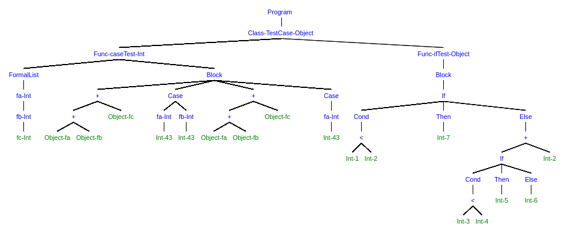

# Cool Compiler - Stanford CS143

Compiler for the *Classroom Object-Oriented Language*

## Progress:

- [x] PA1: A stack machine with cool;
- [x] PA2: Flex based cool lexer;
  - Need more test case.
- [x] PA3: Bison based cool parser;
- [ ] PA4: Static semantic analysis;
- [ ] PA5: Code generator.

## Abstract Syntax Tree
Generated with [Syntree](https://github.com/mshang/syntree)

Special thanks to bilibili for the free video. I have no idea whey Stanford moves everything from the Lagunita to Edx. Do they really need the $100 tuition fee?

